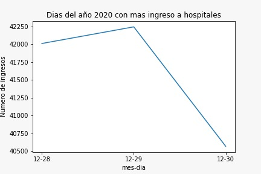

# Herramientas de productividad
## Cursos propedeuticos para la maestria en ciencia de datos- Universidad de Sonora

#### Repositorio que tiene como propósito de analizar datos de la dirección general de epidemiología pertenecientes a México.

**Objetivo:**
Graficar que dias del año 2020 tienen el mayor numero de ingresos a hospitales

**Datos utilizados:**
[COVID-19](https://www.gob.mx/salud/documentos/datos-abiertos-bases-historicas-direccion-general-de-epidemiologia)

Pasos:
1. Clonar nuestro repositorio
~~~
    git clone https://github.com/LauraDi/MCD-Final.git
~~~

2. Generamos la imagen de un dockerfile y contruimos un contenedor
~~~
    docker build -t mcd-covid .
    docker run -it --name Contenedorcovid mcd-covid
~~~

### **Resultados:** 
#### Despues de analizar los datos, se obtuvo que los dias 28,29,30 de Diciembre del año 2020 fueron los dias con mas registros de ingreso a hospitales, donde el mayor numero de ingresos fue de mas de 42,000 personas.

